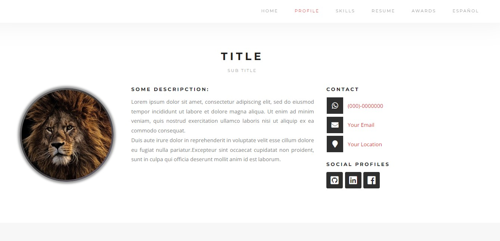

# CV/RESUME JEER
A simple template to write your resume.

This project was generated with [Angular CLI](https://github.com/angular/angular-cli) version 13.3.3.

## Demo

   

   

## Install
Run `npm install`

## Development server

Run `ng serve` for a dev server. Navigate to `http://localhost:4200/`. The application will automatically reload if you change any of the source files.

## Build

Run `ng build` to build the project. The build artifacts will be stored in the `dist/` directory.

## Images 
https://pixabay.com/es/
